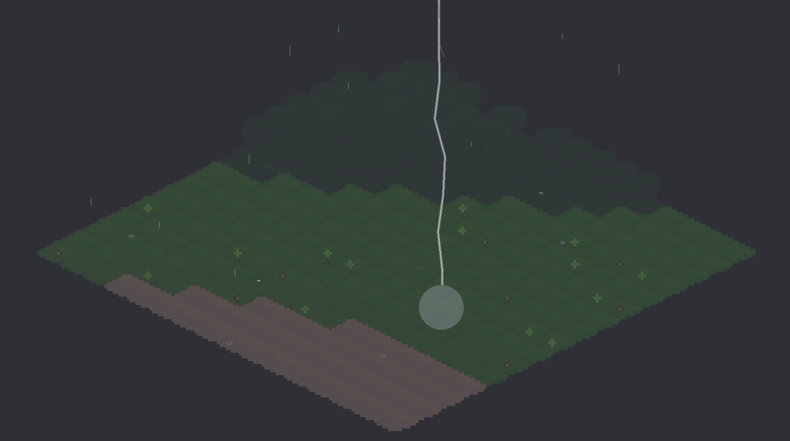
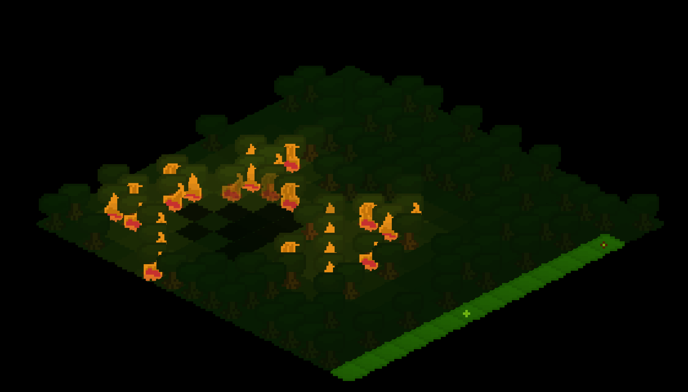
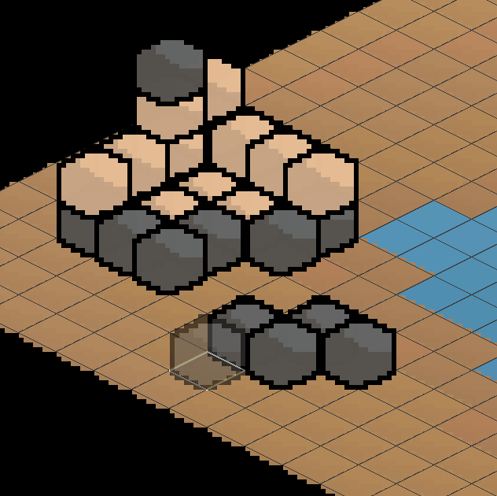
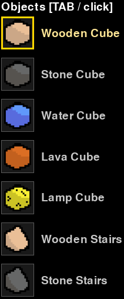
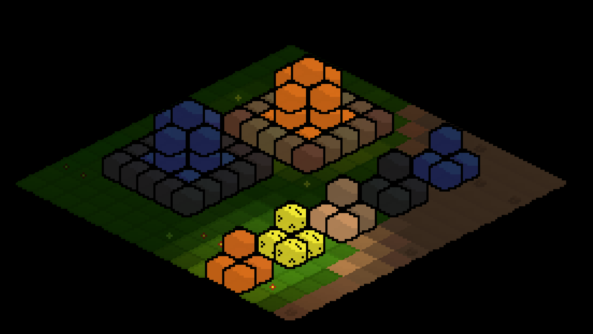
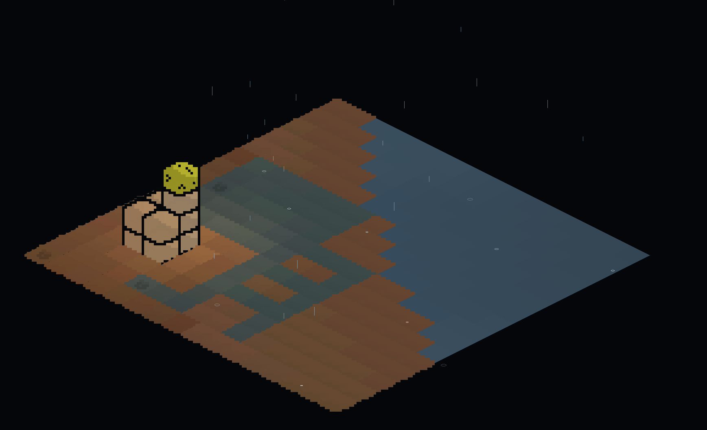
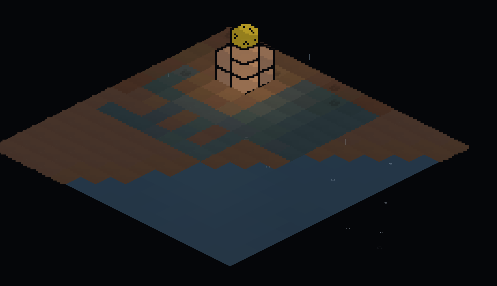
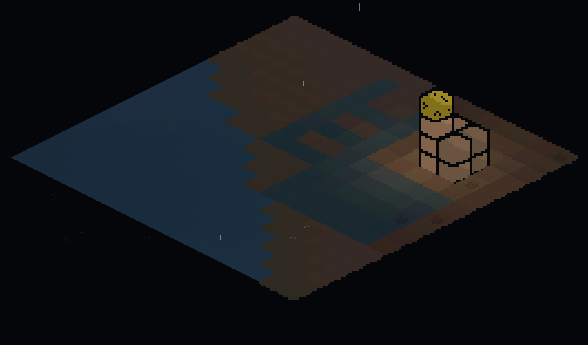
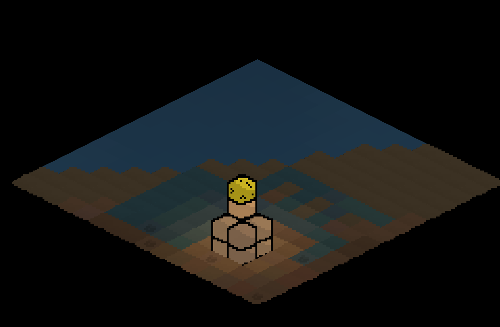

# Isometric SandBox and Game Engine


A procedurally generated isometric (with legacy top-down) game engine built on **Python + Pygame + NumPy**. Chunk-streamed terrain, a biome-aware weather system with smooth crossfades, a real day/night cycle that drives dynamic terrain shading, lightning-sparked forest fires, water that physically flows into dug-out holes, placeable lamps and buildable objects, a rotatable camera, and a layered ambient/weather soundscape — all built as independent, drop-in modules around a single core renderer.

No external art or audio assets are required to run the project: terrain is colored procedurally, fire and lightning are drawn procedurally, and every sound effect is synthesized at startup with NumPy. Point the sound/fire systems at your own `.wav` / `.mp3` / `.ogg` / `.png` files to replace any procedural fallback with real assets whenever you're ready.

---

## Features

### World generation

- Infinite-feeling world split into chunks, generated on demand and cached.
- Terrain height, moisture, temperature and fertility maps are combined into distinct biomes: ocean, beach, grassland, forest, dense forest, hills, mountains, high peaks, desert, savanna, taiga, tundra, swamp and snow.
- Perlin-style noise is fully vectorized with NumPy (no per-tile Python loops), so chunk generation stays fast even at large world sizes.
- Height is normalized against a **global** min/max sampled once across the whole world, so neighboring chunks blend into one continuous, natural-looking landscape instead of each chunk stretching its own local contrast.
- Asynchronous chunk loading via a background thread pool.
- One click (`R`) regenerates the entire world with a fresh seed.

### Weather

- Three precipitation types — **rain**, **snow**, and **sandstorm** — each tied to the biome currently dominating the screen (rain over grass/forest/water, snow over cold/high biomes, sandstorm over desert/savanna).
- Only one type is ever "in charge" at a time; when the dominant biome changes, the old weather **crossfades out** while the new one **crossfades in** — no jarring pops, and no more than one weather type competing for attention.
- Particles are simulated in NumPy arrays (not Python objects), each with its own fall speed, drift, and landing behavior — rain streaks and splashes, snow drifts sideways as it falls, sandstorm particles blow almost horizontally.
- Precipitation lands on the *actual* elevation-adjusted position of each tile, so weather visually "sticks" to hills and mountains instead of floating over flat ground.
- Global timer alternates between clear and stormy periods with randomized durations, and intensity fades in/out smoothly rather than switching instantly (`F2` to force a change).


### Day/night cycle

- A full day/night clock drives everything lighting-related: ambient color temperature (cool blue at night, warm at sunrise/sunset, neutral at noon), overall scene brightness, and the direction of the sun.
- Terrain shading is **directional and dynamic** — slopes facing the sun are brighter, slopes facing away are darker, and the effect rotates over the course of the day instead of using a single fixed light angle.
- Time can be paused (`T`) or nudged forward/backward an hour at a time (`,` / `.`) for testing or cinematic screenshots.

### Manual lighting (lamps)

- Toggle the grid (`G`); hovering the grid highlights the tile under the cursor, and clicking places (or removes) a warm lamp on that tile.

### Thunderstorms

- Rain has a configurable chance (default **25%**, `9`/`0` to adjust) of turning into a full thunderstorm as soon as it starts.
- While a storm is active, lightning strikes a random tile within view every few seconds — a jagged, branching bolt is drawn from the top of the screen down to the struck tile, together with a brief screen-wide flash and a procedurally generated crack-and-rumble thunder sound.
- Each strike is also a real, temporary light source (`get_light_boost`) that briefly brightens the ground and any nearby lamps/objects.
- `Y` force-starts a storm right now, `U` forces an immediate strike, `9`/`0` tune the storm chance — handy for testing without waiting on the weather cycle.

### Forest fires

- Every lightning strike that lands on a tree (in `dense_forest`) has a **5% chance** to set it ablaze.
- A burning tree spreads to any adjacent tree (all 8 neighbors) after a random delay, and to a tile that's already at least half-caught — fire realistically races through a dense cluster of trees and crawls at the edges.
- Each tree burns for a random amount of time before turning to ash, flickering warmly and lighting up its surroundings the whole time (procedurally animated, or drop your own `textures/fire/fire.png` / numbered `fire_1.png`, `fire_2.png`... frames to replace it).
- Ignition plays a sound (`sound/fire/ignite.*`, or a procedurally generated crackle if you don't provide one) — but only if the tree is inside the chunk you're currently viewing, so a fire smoldering far away doesn't steal audio channels from what's actually on screen.
- Once a tree burns out: the grass underneath goes dark and scorched for **2 minutes**, then returns to its normal color, and the tree itself only grows back after **4–5 minutes** total — it doesn't just pop back the instant the ash clears.
- A tree won't grow on a tile that already has a placed object sitting on it, and you can't place an object or dig a hole on a tile that currently has a live tree.

### Textures

The texture system is built on a modular principle and allows layering multiple visual effects on top of base landscape tiles. The core idea is that each biome can have:

- Base landscape texture (in bioms/ folder)
- Additional overlays (grass, trees, flowers)

```
textures/
├── bioms/          # Base biome textures (.png format)
│   ├── grassland.png
│   ├── dense_forest.png
│   ├── forest.png
│   └── ...
├── grass/          # Grass overlays (with transparency)
│   └── grassland.png
├── trees/          # Tree overlays (with transparency)
│   └── dense_forest.png
└── flowers/        # Flower sprites (with transparency)
    ├── flower_red.png
    ├── flower_blue.png
    └── ...
```

### Object Placement

The `object_system.py` module handles placing objects (cubes, stairs, etc.)
in the world — following the same logic as the manual light placement
(`lighting_system.py`): it works on top of the active grid, and clicking a
tile places or removes an object.

### Activation

The whole placement mechanic (lamps, objects, and digging) is only available while the grid is on:

| Key | Action |
|---|---|
| `G` | Show/hide the tile grid |
| `O` | Cycle click mode: **light** → **object** → **dig** → back to **light** |

If the grid is off, clicks on the world don't do anything (other than the
usual camera controls).

### Selecting multiple tiles

Hold **Shift** while the grid is active and move the mouse — a rectangle is
drawn from wherever the cursor was when you pressed Shift to wherever it is
now, capped at **6 tiles on each side** (so anywhere from a 1×6 line up to a
full 6×6 block). Every click action (placing/removing an object, toggling a
lamp, digging/filling a hole) applies to **every tile in the selection at
once**, not just the one tile under the cursor. Release Shift to go back to
selecting a single tile.

### Placing objects

While the grid is active and the placement mode is `object`:

| Action | Result |
|---|---|
| Left click on a tile (or selection) | Place the currently selected object on top of the stack on each tile |
| Right click on a tile (or selection) | Remove the top object from the stack on each tile |
| `TAB` | Cycle through the list of object types (changes the selected type) |
| `I` | Show/hide the object picker panel on the right (see below) |
| `F` | Mirror the object horizontally (see "Mirroring") |

You can't place an object on a tile that currently has a live tree on it —
clear the tree (or wait for fire to burn it down) first.

### Stacks (placement height)

Objects can be stacked on top of each other on a single tile — like blocks
in Minecraft. The maximum stack height is set by the `MAX_STACK_HEIGHT`
constant in `object_system.py` (default **4**). Once a stack is full, left
click on that tile stops placing new blocks until you remove the top one
with a right click.

### Placement preview



While the grid is active and a tile is selected, a semi-transparent
"ghost" of the currently selected object is drawn over it:

- shows the **exact level** the next block will be placed at (taking
  already-stacked blocks into account);
- outlines the tile with a white border so the placement spot is
  unambiguous (turns red if the tile is blocked, e.g. by a tree);
- shows nothing if the stack is already full — it's immediately clear
  there's nowhere left to place a block.

### Mirroring (`F`)

Useful for asymmetric objects (stairs):

- if the selected tile already has an object — `F` mirrors the **top**
  block of the stack horizontally;
- if the tile is empty — `F` toggles a "mirror the next placement" flag;
  this is immediately reflected in the ghost preview and in the status
  line (`[mirrored]`).

### Object picker panel (`I`)



While the grid is active, `I` opens a panel on the right listing all
available object types:

- each entry shows a texture preview (or a placeholder if the texture
  isn't on disk) and a label;
- the currently selected type is highlighted with a yellow border;
- clicking a slot selects that type **and** switches the placement mode
  to `object`.

### Available object types


| Type | Texture file | Notes |
|---|---|---|
| `wooden_cube` | `wooden_cube.png` | plain block |
| `stone_cube` | `stone_cube.png` | plain block |
| `water_cube` | `water_cube.png` | plain block |
| `lava_cube` | `lava_cube.png` | glows with a warm, flickering light |
| `lamp_cube` | `lamp_cube.png` | glows with a steady warm light |
| `wooden_stairs` | `wooden_stairs.png` | asymmetric — supports mirroring |
| `stone_stairs` | `stone_stairs.png` | asymmetric — supports mirroring |

Textures are looked up in `textures/objects/<name>.png` (or
`.jpg/.jpeg/.bmp`) next to the scripts, or in `/textures/objects`. If a
file is missing, a simple isometric placeholder box is drawn instead so
the placement spot is still visible — and the whole mechanic (stacking,
mirroring, lighting) keeps working regardless.

### Reacting to lighting



All placed objects (regardless of type) are tinted according to the
current scene lighting — the same way the ground and trees are:

- the day/night cycle (`sun_system.py`);
- light from placed lamps (`lighting_system.py`);
- lightning flashes during a storm (`thunderstorm_system.py`);
- nearby burning trees (`fire_system.py`).

This works through `light_fn` — a `(tile_x, tile_y) -> (r, g, b)` function
passed into `ObjectSystem.render(...)`.

### Light-emitting cubes


`lava_cube` and `lamp_cube` don't just look lit — they **are** light
sources: placing one on a tile automatically registers a real light in
`LightingSystem` (color/radius/brightness taken from
`OBJECT_TYPES[...]['light']`), which lights up everything around it.
Removing the cube automatically removes the light. If a stack has several
glowing cubes, the topmost one is the one that lights up. `lava_cube` also
flickers slightly (the `flicker` parameter), while `lamp_cube` shines
steadily.

Lights registered this way don't get confused with lights the player
places manually (`light` mode + click, via `toggle_light_at`) — they're
tracked separately.

### Adding a new object type

All it takes is one entry in `OBJECT_TYPES` in `object_system.py`:

```python
'stone_crate': {
    'label': 'Stone Crate',        # name shown in the picker panel
    'texture': 'stone_crate',      # texture filename without extension
    'width_scale': 1.0,            # sprite width relative to the tile
    'level_height_scale': 0.5,     # height of one stack level
    # optional — if the object should glow:
    # 'light': {'color': (255, 200, 120), 'radius': 4.0,
    #           'intensity': 1.0, 'flicker': 0.0},
},
```

The new type will immediately show up in the picker panel (`I`), in the
`TAB` cycle, and will fully support stacking/mirroring/lighting — no
changes needed anywhere else in the code.

### Digging & water flow

- Switch the placement mode to `dig` (`O`) and left-click a tile (or a Shift
  selection) to dig it out; right-click fills it back in. You can't dig
  under a placed object or a live tree — remove those first.
- A dug tile darkens, and — since the tile's lighting-adjusted color is
  computed once and reused for the ground *and* every overlay drawn on top
  of it — the whole hole (and anything visually layered on it) darkens
  together as a single "empty pit" effect.
- If a hole ends up next to `shallow_water`, water gradually flows in and
  fills it — and behaves a little like Dwarf Fortress: a **wide pool** (part
  of a solid 2×2-or-bigger dug block) fills a bit **slower**, while a
  **narrow, one-tile-wide corridor or dead end** fills **much faster**, as if
  under pressure through a single channel. A filled (or half-filled)
  hole becomes a water source for its own neighbors, so water can chain
  through a whole dug-out network, not just the one tile touching the pond.
- The water in a hole reacts to lighting exactly like ordinary water — day/
  night tint, nearby lamps, fire glow — plus a subtle ripple, instead of
  freezing into one flat, unlit color once it's full.

### Camera rotation




- Hold the **middle mouse button** and drag left/right to spin the camera around the world.
- Isometric diamond tiles only tile seamlessly at 0°/90°/180°/270°, so dragging accumulates motion and, once you've dragged far enough, snaps cleanly to the next 90° step (drag further/faster to jump multiple steps at once) — no in-between angle is ever actually rendered, so there are never gaps in the ground grid.
- The snap itself is instant, but a short crossfade (the old view fading out over the new one, ~0.18s) makes the turn read as a smooth, real-time rotation instead of a hard cut.
- Camera-relative controls (`WASD`, right-click pan) keep working the way you'd expect after rotating — "forward" is still "up the screen", not a fixed world direction.

### Sound
- Two independent layers: a looping **biome ambience** and a **weather** track, each with its own crossfade.
- Biome ambience loads from your own audio files (`sound/bioms/forest.*`, `plains.*`, `desert.*`, `water.*`, `mountains.*`, `swamp.*` — `.wav`/`.mp3`/`.ogg`, first match wins). Any biome missing a file falls back to a procedurally generated wind/water/critter texture so the game is never silent, with a clear console warning telling you exactly which file to add.
- Weather sound (rain/snow/sandstorm) is fully procedural — filtered/modulated noise, no assets needed — and its volume tracks the current precipitation intensity.
- One-shot sound effects (thunder, tree ignition) go through a small dedicated pool of channels (`play_one_shot`) that's always kept separate from the looping ambience/weather channels — a burst of simultaneous effects can never accidentally steal and silence a background loop.
- Ambience and weather both fade to silence underground or while a chunk is still loading, instead of cutting abruptly.
- Master volume with `-` / `=`.

### UI & tools
- Live info panel (FPS, camera/chunk position, zoom, weather/sun/light/sound/fire/digging status, camera rotation, current selection size, tile under cursor).
- Minimap with click-to-travel.
---

## Minimum system requirements

- CPU: dual core processor 1.6 Ghz.
- GPU: Intel HD Graphics 400.
- RAM: 4Gb.
- OS: Windows 10/11; Linux.

## Requirements

- Python 3.9+
- [`pygame`](https://www.pygame.org/) 2.x
- [`numpy`](https://numpy.org/)

```bash
pip install pygame numpy
```

No audio or image assets are required to run the project out of the box.

---

## Running it

```bash
python generation_wold.py
```

The world opens in fullscreen.

---

## Project structure
The engine is deliberately split into small, self-contained modules. Most only need `update(dt)` called once per frame and take the shared `screen` surface (or a couple of small helper callbacks) to render — none of them know about each other directly, so any one of them can be lifted out, replaced, or reused in a different project with minimal changes.
```
.
├── generation_wold.py       # World generation, chunk streaming, camera/rendering, input, UI
├── weather_system.py        # Rain / snow / sandstorm particles, biome crossfade
├── sun_system.py             # Day/night clock, ambient tint, directional shading, sun disc/rays
├── lighting_system.py       # Placeable lamps, tile light-boost, post/bulb rendering
├── thunderstorm_system.py   # Lightning strikes during rain, screen flash, thunder audio
├── fire_system.py            # Tree ignition, spreading, burnout, scorched-grass/regrowth timers
├── object_system.py          # Placeable objects (cubes, stairs), stacking, mirroring, picker UI
├── digging_system.py         # Dug-out tiles (holes), darkening, dirt fill-back-in
├── water_flow_system.py      # Water physics flowing into holes near shallow_water
├── camera_rotation_system.py # 90°-stepped camera rotation, drag-to-rotate
├── sound_system.py           # Biome ambience (file-based) + procedural weather audio + SFX channel pool
├── texture_manager.py        # Texture loading, caching, and overlay management
├── sound/
│   ├── bioms/                # Drop your own forest.wav / plains.mp3 / etc. here (optional)
│   └── fire/                 # Drop your own ignite.wav here (optional)
└── textures/
    ├── bioms/                # Base biome textures (.png format)
    │   ├── grassland.png
    │   ├── dense_forest.png
    │   ├── forest.png
    │   └── ...
    ├── grass/                # Grass overlays (with transparency)
    │   └── grassland.png
    ├── trees/                # Tree overlays (with transparency)
    │   └── dense_forest.png
    ├── flowers/               # Flower sprites (with transparency)
    │   ├── flower_red.png
    │   ├── flower_blue.png
    │   └── ...
    ├── objects/               # Placeable object textures (with transparency)
    │   ├── wooden_cube.png
    │   ├── stone_cube.png
    │   ├── water_cube.png
    │   ├── lava_cube.png
    │   ├── lamp_cube.png
    │   ├── wooden_stairs.png
    │   └── stone_stairs.png
    └── fire/                  # Drop your own fire.png (or fire_1.png, fire_2.png, ...) here (optional)
```

### Module responsibilities at a glance
| Module | Owns | Talks to the world via |
|---|---|---|
| `weather_system.py` | Precipitation state machine, particle simulation, rendering | `set_area()` / `set_area_polygon()`, `set_biome_landing_points()`, `set_dominant_kind()` |
| `sun_system.py` | Time of day, ambient tint, light direction, sun visuals | `apply_tint()`, `get_light_direction()`, `get_elevation()` |
| `lighting_system.py` | Lamp placement & rendering | `toggle_light_at()`, `get_tile_light_boost()`, `render(..., chunk_bounds=...)` |
| `thunderstorm_system.py` | Lightning strikes, thunder, storm state | `update(dt, weather_kind, weather_intensity, camera_tile_bounds, biome_at_fn, current_biome)`, `get_light_boost()`, `render()`, `on_strike` callback |
| `fire_system.py` | Tree ignition/spread/burnout, scorched-grass and regrowth timers | `try_ignite_from_lightning()`, `update(dt, tree_at_fn)`, `get_light_boost()`, `render()` |
| `object_system.py` | Placeable object stacks, mirroring, picker UI, self-lit cubes | `place_object_at()` / `remove_top_object_at()`, `render_at_tile(..., light_fn=...)`, `render_preview()` |
| `digging_system.py` | Dug-tile state, darkening | `dig_at()` / `fill_dirt_at()`, `apply_darken()` |
| `water_flow_system.py` | Water spreading into holes | `update(dt, water_neighbor_fn)`, `get_water_color()` |
| `camera_rotation_system.py` | Camera rotation state, coordinate transform | `to_view_space()` / `to_world_space()`, `accumulate_drag()` |
| `sound_system.py` | Ambient/weather/one-shot audio playback | `set_dominant_biome()`, `set_weather()`, `play_one_shot()`, `set_active_chunk_bounds()` |
| `texture_manager.py` | Texture loading, caching, and overlay management | `get_diamond_texture()`, `get_grass_overlay()`, `get_tree_overlay()`, `get_flower_texture()` |

`generation_wold.py` is the only module that knows about all the others; it computes the "dominant biome/weather kind" for the current camera view once per frame (with hysteresis, so the result doesn't flicker right on a biome border) and feeds it to whichever systems need it.

---

## Controls
| Key | Action |
|---|---|
| `WASD` / Arrow keys | Move camera (camera-relative — stays intuitive after rotating) |
| `Shift` + move | Move faster |
| Right-click drag | Pan camera |
| Middle-click drag | Rotate camera (snaps to 90° steps, smoothed with a crossfade) |
| Left-click (minimap) | Jump camera to that point |
| `G` | Toggle grid — hover to highlight a tile |
| `Shift` + hover (grid) | Select a rectangle of tiles (up to 6×6) instead of just one |
| `O` | Cycle grid-click mode: **light** → **object** → **dig** |
| Left-click (grid, light mode) | Toggle a lamp on the selected tile(s) |
| Left-click (grid, object mode) | Place the selected object on top of the stack |
| Right-click (grid, object mode) | Remove the top object from the stack |
| Left-click (grid, dig mode) | Dig a hole |
| Right-click (grid, dig mode) | Fill the hole back in |
| `TAB` | Cycle the selected object type |
| `F` | Mirror the top object on the selected tile, or arm mirroring for the next placement |
| `I` | Toggle info panel (grid off) / object picker panel (grid on) |
| `L` | Force-ignite the selected tile (fire testing) |
| `M` | Toggle minimap |
| `R` | Regenerate the world with a new seed |
| `F2` | Force a weather change |
| `9` / `0` | Decrease / increase thunderstorm chance |
| `Y` | Force-start a thunderstorm right now |
| `U` | Force a lightning strike right now |
| `T` | Pause / resume the day-night clock |
| `,` `.` | Step time back / forward one hour |
| `-` / `=` | Master volume down / up |
| `Ctrl+C` | Recenter camera on the world |
| `F11` | Toggle fullscreen |
| `Esc` | Quit |
---

## Adding your own biome ambience

Drop audio files into `sound/bioms/` next to `generation_wold.py`, named after the biome category (any of `.wav`, `.mp3`, `.ogg`):

```
sound/bioms/
├── forest.mp3
├── plains.wav
├── desert.ogg
├── water.wav
├── mountains.mp3
└── swamp.wav
```

Anything you don't provide simply keeps using the built-in procedural fallback — you can add files one biome at a time. If you'd rather keep sounds somewhere else entirely, pass your own search path(s) to `SoundSystem(biome_sound_dirs=[...])`.
