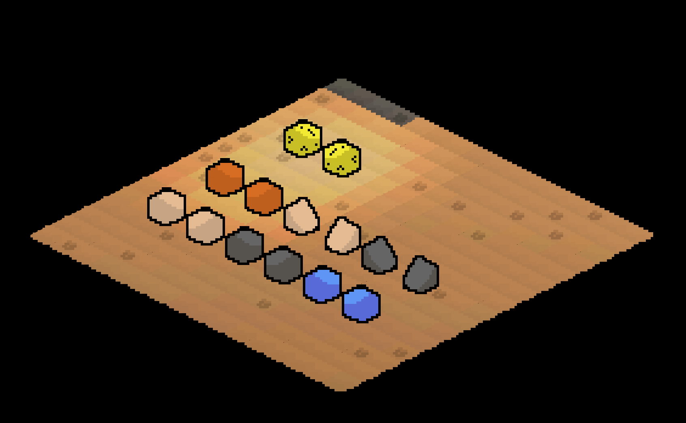
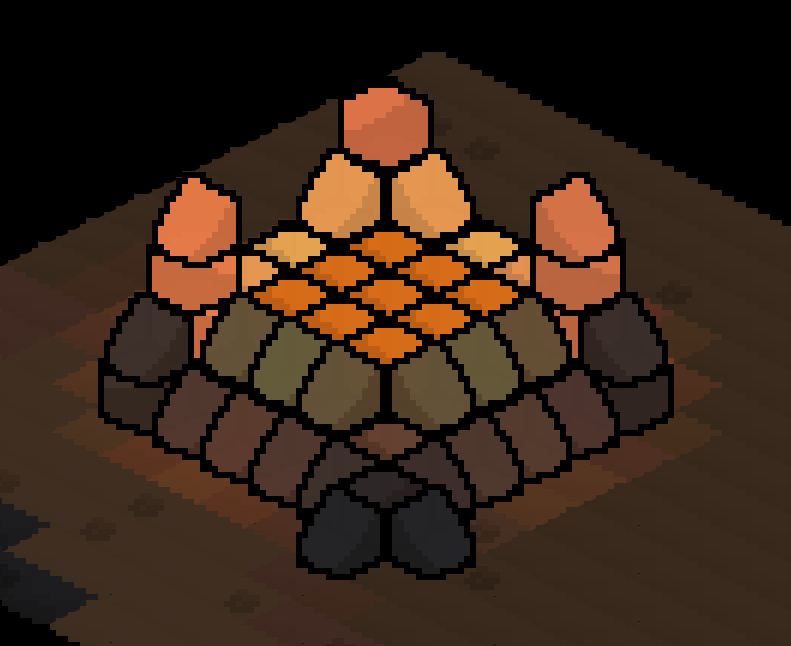

# Isometric Game Engine


A procedurally generated isometric (with legacy top-down) game engine built on **Python + Pygame + NumPy**. Chunk-streamed terrain, a biome-aware weather system with smooth crossfades, a real day/night cycle that drives dynamic terrain shading, placeable lamps, and a layered ambient/weather soundscape — all built as independent, drop-in modules around a single core renderer.

No external art or audio assets are required to run the project: terrain is colored procedurally, and every sound effect is synthesized at startup with NumPy. Point the sound system at your own `.wav` / `.mp3` / `.ogg` files to replace the biome ambience with real recordings whenever you're ready.

---

## Features

### World generation

- Infinite-feeling world split into chunks, generated on demand and cached.
- Terrain height, moisture, temperature and fertility maps are combined into distinct biomes: ocean, beach, grassland, forest, dense forest, hills, mountains, high peaks, desert, savanna, taiga, tundra, swamp and snow.
- Perlin-style noise is fully vectorized with NumPy (no per-tile Python loops), so chunk generation stays fast even at large world sizes.
- Height is normalized against a **global** min/max sampled once across the whole world, so neighboring chunks blend into one continuous, natural-looking landscape instead of each chunk stretching its own local contrast.
- Asynchronous chunk loading via a background thread pool.
- One click (`R`) regenerates the entire world with a fresh seed.

### Weather

- Three precipitation types — **rain**, **snow**, and **sandstorm** — each tied to the biome currently dominating the screen (rain over grass/forest/water, snow over cold/high biomes, sandstorm over desert/savanna).
- Only one type is ever "in charge" at a time; when the dominant biome changes, the old weather **crossfades out** while the new one **crossfades in** — no jarring pops, and no more than one weather type competing for attention.
- Particles are simulated in NumPy arrays (not Python objects), each with its own fall speed, drift, and landing behavior — rain streaks and splashes, snow drifts sideways as it falls, sandstorm particles blow almost horizontally.
- Precipitation lands on the *actual* elevation-adjusted position of each tile, so weather visually "sticks" to hills and mountains instead of floating over flat ground.
- Global timer alternates between clear and stormy periods with randomized durations, and intensity fades in/out smoothly rather than switching instantly (`F2` to force a change).


### Day/night cycle

- A full day/night clock drives everything lighting-related: ambient color temperature (cool blue at night, warm at sunrise/sunset, neutral at noon), overall scene brightness, and the direction of the sun.
- Terrain shading is **directional and dynamic** — slopes facing the sun are brighter, slopes facing away are darker, and the effect rotates over the course of the day instead of using a single fixed light angle.
- Time can be paused (`T`) or nudged forward/backward an hour at a time (`,` / `.`) for testing or cinematic screenshots.

### Manual lighting (lamps)

- Toggle the grid (`G`); hovering the grid highlights the tile under the cursor, and clicking places (or removes) a warm lamp on that tile.

### Textures

The texture system is built on a modular principle and allows layering multiple visual effects on top of base landscape tiles. The core idea is that each biome can have:

- Base landscape texture (in bioms/ folder)
- Additional overlays (grass, trees, flowers)

```
textures/
├── bioms/          # Base biome textures (.png format)
│   ├── grassland.png
│   ├── dense_forest.png
│   ├── forest.png
│   └── ...
├── grass/          # Grass overlays (with transparency)
│   └── grassland.png
├── trees/          # Tree overlays (with transparency)
│   └── dense_forest.png
└── flowers/        # Flower sprites (with transparency)
    ├── flower_red.png
    ├── flower_blue.png
    └── ...
```

### Object Placement

The `object_system.py` module handles placing objects (cubes, stairs, etc.)
in the world — following the same logic as the manual light placement
(`lighting_system.py`): it works on top of the active grid, and clicking a
tile places or removes an object.

### Activation

The whole object-placement mechanic is only available while the grid is on:

| Key | Action |
|---|---|
| `G` | Show/hide the tile grid |
| `O` | Toggle click mode: **light** ↔ **object** |

If the grid is off, clicks on the world don't do anything (other than the
usual camera controls).

### Placing objects

While the grid is active and the placement mode is `object`:

| Action | Result |
|---|---|
| Left click on a tile | Place the currently selected object on top of the stack on that tile |
| Right click on a tile | Remove the top object from the stack on that tile |
| `TAB` | Cycle through the list of object types (changes the selected type) |
| `I` | Show/hide the object picker panel on the right (see below) |
| `F` | Mirror the object horizontally (see "Mirroring") |

### Stacks (placement height)

Objects can be stacked on top of each other on a single tile — like blocks
in Minecraft. The maximum stack height is set by the `MAX_STACK_HEIGHT`
constant in `object_system.py` (default **4**). Once a stack is full, left
click on that tile stops placing new blocks until you remove the top one
with a right click.

### Placement preview

While the grid is active and a tile is selected, a semi-transparent
"ghost" of the currently selected object is drawn over it:

- shows the **exact level** the next block will be placed at (taking
  already-stacked blocks into account);
- outlines the tile with a white border so the placement spot is
  unambiguous;
- shows nothing if the stack is already full — it's immediately clear
  there's nowhere left to place a block.

### Mirroring (`F`)

Useful for asymmetric objects (stairs):

- if the selected tile already has an object — `F` mirrors the **top**
  block of the stack horizontally;
- if the tile is empty — `F` toggles a "mirror the next placement" flag;
  this is immediately reflected in the ghost preview and in the status
  line (`[mirrored]`).

### Object picker panel (`I`)

While the grid is active, `I` opens a panel on the right listing all
available object types:

- each entry shows a texture preview (or a placeholder if the texture
  isn't on disk) and a label;
- the currently selected type is highlighted with a yellow border;
- clicking a slot selects that type **and** switches the placement mode
  to `object`.

### Available object types



| Type | Texture file | Notes |
|---|---|---|
| `wooden_cube` | `wooden_cube.png` | plain block |
| `stone_cube` | `stone_cube.png` | plain block |
| `water_cube` | `water_cube.png` | plain block |
| `lava_cube` | `lava_cube.png` | glows with a warm, flickering light |
| `lamp_cube` | `lamp_cube.png` | glows with a steady warm light |
| `wooden_stairs` | `wooden_stairs.png` | asymmetric — supports mirroring |
| `stone_stairs` | `stone_stairs.png` | asymmetric — supports mirroring |

Textures are looked up in `textures/objects/<name>.png` (or
`.jpg/.jpeg/.bmp`) next to the scripts, or in `/textures/objects`. If a
file is missing, a simple isometric placeholder box is drawn instead so
the placement spot is still visible — and the whole mechanic (stacking,
mirroring, lighting) keeps working regardless.

### Reacting to lighting

All placed objects (regardless of type) are tinted according to the
current scene lighting — the same way the ground and trees are:

- the day/night cycle (`sun_system.py`);
- light from placed lamps (`lighting_system.py`);
- lightning flashes during a storm (`thunderstorm_system.py`).

This works through `light_fn` — a `(tile_x, tile_y) -> (r, g, b)` function
passed into `ObjectSystem.render(...)`.

### Light-emitting cubes



`lava_cube` and `lamp_cube` don't just look lit — they **are** light
sources: placing one on a tile automatically registers a real light in
`LightingSystem` (color/radius/brightness taken from
`OBJECT_TYPES[...]['light']`), which lights up everything around it.
Removing the cube automatically removes the light. If a stack has several
glowing cubes, the topmost one is the one that lights up. `lava_cube` also
flickers slightly (the `flicker` parameter), while `lamp_cube` shines
steadily.

Lights registered this way don't get confused with lights the player
places manually (`light` mode + click, via `toggle_light_at`) — they're
tracked separately.

## Adding a new object type

All it takes is one entry in `OBJECT_TYPES` in `object_system.py`:

```python
'stone_crate': {
    'label': 'Stone Crate',        # name shown in the picker panel
    'texture': 'stone_crate',      # texture filename without extension
    'width_scale': 1.0,            # sprite width relative to the tile
    'level_height_scale': 0.5,     # height of one stack level
    # optional — if the object should glow:
    # 'light': {'color': (255, 200, 120), 'radius': 4.0,
    #           'intensity': 1.0, 'flicker': 0.0},
},
```

The new type will immediately show up in the picker panel (`I`), in the
`TAB` cycle, and will fully support stacking/mirroring/lighting — no
changes needed anywhere else in the code.


### Sound
- Two independent layers: a looping **biome ambience** and a **weather** track, each with its own crossfade.
- Biome ambience loads from your own audio files (`sound/bioms/forest.*`, `plains.*`, `desert.*`, `water.*`, `mountains.*`, `swamp.*` — `.wav`/`.mp3`/`.ogg`, first match wins). Any biome missing a file falls back to a procedurally generated wind/water/critter texture so the game is never silent, with a clear console warning telling you exactly which file to add.
- Weather sound (rain/snow/sandstorm) is fully procedural — filtered/modulated noise, no assets needed — and its volume tracks the current precipitation intensity.
- Ambience and weather both fade to silence underground or while a chunk is still loading, instead of cutting abruptly.
- Master volume with `-` / `=`.

### UI & tools
- Live info panel (FPS, camera/chunk position, zoom, weather/sun/light/sound status, tile under cursor).
- Minimap with click-to-travel.
---

## Requirements

- Python 3.9+
- [`pygame`](https://www.pygame.org/) 2.x
- [`numpy`](https://numpy.org/)

```bash
pip install pygame numpy
```

No audio or image assets are required to run the project out of the box.

---

## Running it

```bash
python generation_wold.py
```

The world opens in fullscreen.

---

## Project structure

The engine is deliberately split into small, self-contained modules. Each one only needs `update(dt)` called once per frame and takes the shared `screen` surface (or a couple of small helper callbacks) to render — none of them know about each other directly, so any one of them can be lifted out, replaced, or reused in a different project with minimal changes.

```
.
├── generation_world.py     # World generation, chunk streaming, camera/rendering, input, UI
├── weather_system.py       # Rain / snow / sandstorm particles, biome crossfade
├── sun_system.py           # Day/night clock, ambient tint, directional shading, sun disc/rays
├── lighting_system.py      # Placeable lamps, tile light-boost, post/bulb rendering
├── sound_system.py         # Biome ambience (file-based) + procedural weather audio
├── texture_manager.py      # Texture loading, caching, and overlay management
├── sound/
│   └── bioms/              # Drop your own forest.wav / plains.mp3 / etc. here (optional)
└── textures/
    ├── bioms/              # Base biome textures (.png format)
    │   ├── grassland.png
    │   ├── dense_forest.png
    │   ├── forest.png
    │   └── ...
    ├── grass/              # Grass overlays (with transparency)
    │   └── grassland.png
    ├── trees/              # Tree overlays (with transparency)
    │   └── dense_forest.png
    └── flowers/            # Flower sprites (with transparency)
        ├── flower_red.png
        ├── flower_blue.png
        └── ...
```

### Module responsibilities at a glance

| Module | Owns | Talks to the world via |
|---|---|---|
| `weather_system.py` | Precipitation state machine, particle simulation, rendering | `set_area()` / `set_area_polygon()`, `set_biome_landing_points()`, `set_dominant_kind()` |
| `sun_system.py` | Time of day, ambient tint, light direction, sun visuals | `apply_tint()`, `get_light_direction()`, `get_elevation()` |
| `lighting_system.py` | Lamp placement & rendering | `toggle_light_at()`, `get_tile_light_boost()`, `render(..., chunk_bounds=...)` |
| `sound_system.py` | Ambient/weather audio playback | `set_dominant_biome()`, `set_weather()` |
| `texture_manager.py` | Texture loading, caching, and overlay management | `get_diamond_texture()`, `get_grass_overlay()`, `get_tree_overlay()`, `get_flower_texture()` |

`generation_wold.py` is the only module that knows about all the others; it computes the "dominant biome/weather kind" for the current camera view once per frame (with hysteresis, so the result doesn't flicker right on a biome border) and feeds it to whichever systems need it.

---

## Controls

| Key | Action |
|---|---|
| `WASD` / Arrow keys | Move camera |
| `Shift` + move | Move faster |
| Right-click drag | Pan camera |
| Left-click (minimap) | Jump camera to that point |
| `G` | Toggle grid — hover to highlight a tile, click to place/remove a lamp |
| `M` | Toggle minimap |
| `I` | Toggle info panel |
| `R` | Regenerate the world with a new seed |
| `F2` | Force a weather change |
| `T` | Pause / resume the day-night clock |
| `,` `.` | Step time back / forward one hour |
| `-` / `=` | Master volume down / up |
| `Ctrl+C` | Recenter camera on the world |
| `F11` | Toggle fullscreen |
| `Esc` | Quit |

---

## Adding your own biome ambience

Drop audio files into `sound/bioms/` next to `generation_wold.py`, named after the biome category (any of `.wav`, `.mp3`, `.ogg`):

```
sound/bioms/
├── forest.mp3
├── plains.wav
├── desert.ogg
├── water.wav
├── mountains.mp3
└── swamp.wav
```

Anything you don't provide simply keeps using the built-in procedural fallback — you can add files one biome at a time. If you'd rather keep sounds somewhere else entirely, pass your own search path(s) to `SoundSystem(biome_sound_dirs=[...])`.
