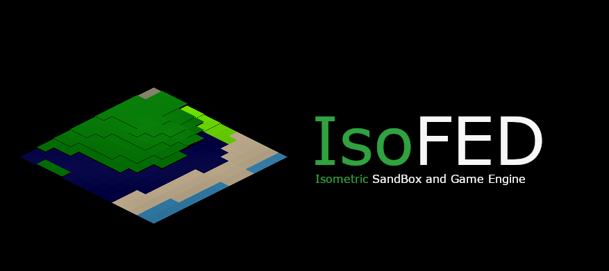

# Изометрическая песочница и игровой движок

[English](README.md) | **Русский**



Процедурно генерируемый изометрический игровой движок на **Python + Pygame + NumPy**. Потоковая подгрузка мира по чанкам, система погоды с плавными кроссфейдами между биомами, полноценный цикл дня и ночи с динамическим освещением рельефа, лесные пожары от молний, вода, физически затекающая в выкопанные ямы, ручные лампы и строительные объекты (включая детонирующие бомбы и систему рельс/вагонетки, на которой можно кататься), вращаемая камера и многослойный эмбиент/погодный звук — всё реализовано как независимые, подключаемые модули вокруг единого рендерера.

Для запуска проекта не нужны никакие внешние арт- или аудио-ассеты: рельеф раскрашивается процедурно, огонь и молния рисуются процедурно, а каждый звук синтезируется при старте через NumPy. При желании можно подключить свои файлы `.wav` / `.mp3` / `.ogg` / `.png` в системы звука/огня, чтобы заменить любой процедурный вариант на реальные ассеты.

---

## Возможности

### Генерация мира

- Мир, ощущающийся бесконечным, разбит на чанки, которые генерируются по требованию и кэшируются.
- Карты высоты, влажности, температуры и плодородия почвы объединяются в отдельные биомы: океан, пляж, луга, лес, густой лес, холмы, горы, высокие пики, пустыня, саванна, тайга, тундра, болото и снег.
- Шум в духе Перлина полностью векторизован через NumPy (без Python-циклов по тайлам), поэтому генерация чанков остаётся быстрой даже на больших размерах мира.
- Высота нормализуется относительно **глобального** мин/макс, посчитанного один раз по всему миру, поэтому соседние чанки сливаются в один непрерывный, естественно выглядящий ландшафт, а не растягивают каждый свой локальный контраст.
- Асинхронная подгрузка чанков через пул фоновых потоков.
- Одна клавиша (`R`) регенерирует весь мир с новым сидом — и заодно стирает **весь прогресс игрока** (поставленные объекты, ямы, лампы, огонь/золу, следы взрывов, рельсы и вагонетку), так что вы каждый раз начинаете с по-настоящему чистого листа, а не с нового рельефа поверх старых остатков.

### Погода

- Три типа осадков — **дождь**, **снег** и **песчаная буря** — каждый привязан к биому, который сейчас доминирует на экране (дождь над травой/лесом/водой, снег над холодными/высокими биомами, песчаная буря над пустыней/саванной).
- В любой момент "главенствует" только один тип; когда доминирующий биом меняется, старая погода **плавно исчезает**, а новая **плавно появляется** — без резких скачков и без конкуренции нескольких типов погоды одновременно.
- Частицы симулируются в NumPy-массивах (а не Python-объектах), у каждой своя скорость падения, снос и поведение при приземлении — дождь оставляет полосы и брызги, снег сносит в сторону при падении, песчаная буря дует почти горизонтально.
- Осадки приземляются на *реальную*, скорректированную по высоте позицию каждого тайла, поэтому погода визуально "прилипает" к холмам и горам, а не парит над плоской землёй.
- Глобальный таймер чередует ясные и штормовые периоды со случайной длительностью, а интенсивность плавно нарастает/спадает, а не переключается мгновенно (`F2` — принудительно сменить погоду).


### Цикл дня и ночи

- Полноценные часы дня/ночи управляют всем, что связано с освещением: цветовой температурой (холодный синий ночью, тёплый на рассвете/закате, нейтральный в полдень), общей яркостью сцены и направлением солнца.
- Затенение рельефа **направленное и динамическое** — склоны, обращённые к солнцу, светлее, обращённые в другую сторону — темнее, и этот эффект вращается в течение дня, а не использует один фиксированный угол света.
- Время можно поставить на паузу (`T`) или сдвинуть на час вперёд/назад (`,` / `.`) — для тестов или постановочных скриншотов.

### Ручное освещение (лампы)

- Включите сетку (`G`); при наведении подсвечивается тайл под курсором, а клик ставит (или убирает) тёплую лампу на этом тайле.
- Свет не проходит сквозь стены: если между лампой и тайлом стоит поставленный объект, этот тайл не получает от лампы ничего — проверяется настоящей трассировкой прямой видимости между ними, а не просто плоским радиусом.
- Лампа, стоящая на вершине высокой постройки, не "просачивается" вниз на голую землю у основания той же колонки — вместо этого она освещает окрестности на своей собственной высоте.
- Земля под любой высокой постройкой сама по себе чуть темнее, пропорционально тому, сколько блоков на ней стоит — простой эффект "что-то заслоняет небо", не зависящий ни от одной лампы.

### Гроза

- Дождь с настраиваемым шансом (по умолчанию **25%**, `9`/`0` — изменить) перерастает в полноценную грозу сразу, как только начинается.
- Пока гроза активна, молния каждые несколько секунд бьёт в случайный тайл в пределах видимости — на экране рисуется зигзагообразный, ветвящийся разряд от верха экрана до места удара, вместе с короткой вспышкой на весь экран и процедурно сгенерированным звуком грома (щелчок + рокот).
- Каждый удар — это ещё и настоящий, временный источник света (`get_light_boost`), который на миг подсвечивает землю и ближайшие лампы/объекты.
- `Y` — принудительно начать грозу прямо сейчас, `U` — принудительный удар молнии, `9`/`0` — настройка шанса грозы: удобно для тестирования, не дожидаясь погодного цикла.

### Лесные пожары

- Каждый удар молнии, попавший в дерево (в биоме `dense_forest`), имеет **5% шанс** его поджечь.
- Горящее дерево через случайную задержку перекидывается на любое соседнее дерево (все 8 соседей), а также на тайл, который уже разгорелся хотя бы наполовину — огонь реалистично быстро проходит через густую группу деревьев и медленнее расползается по краям.
- Каждое дерево горит случайное время, прежде чем превратиться в золу, всё это время тепло мерцая и подсвечивая окрестности (процедурная анимация, либо можно подложить свою `textures/fire/fire.png` или пронумерованные кадры `fire_1.png`, `fire_2.png`...).
- Возгорание проигрывает звук (`sound/fire/ignite.*`, либо процедурно сгенерированный треск, если своего файла нет) — но только если дерево находится в чанке, который вы сейчас видите, чтобы тлеющий где-то вдалеке пожар не отнимал звуковые каналы у того, что реально на экране.
- Когда дерево прогорает: трава под ним темнеет и выглядит обгоревшей **2 минуты**, затем возвращается к обычному цвету, а само дерево отрастает заново только через **4–5 минут** в общей сложности — оно не появляется мгновенно, как только исчезает зола.
- Дерево не вырастет на тайле, где уже стоит поставленный объект, а поставить объект или выкопать яму на тайле с живым деревом нельзя.
- Огонь нельзя разжечь на воде — принудительный поджог (`L`, см. ниже) просто отказывается на любом водном тайле, а обычная молния/распространение и так никогда не касаются воды, поскольку это никогда не `dense_forest`.
- `L` — принудительный/отладочный поджог, поэтому, в отличие от естественного распространения, он не считается с "ещё не сошедшим" восстановлением тайла: нажатие на месте, где уже горело, разжигает заново немедленно, а не молчит, пока не истечёт полный внутренний таймер восстановления. Единственное, что реально мешает — тайл, который горит прямо сейчас.

### Текстуры

Система текстур построена на модульном принципе и позволяет накладывать друг на друга несколько визуальных эффектов поверх базовых тайлов ландшафта. Основная идея в том, что у каждого биома может быть:

- Базовая текстура ландшафта (в папке bioms/)
- Дополнительные слои-наложения (трава, деревья, цветы)

```
textures/
├── bioms/          # Базовые текстуры биомов (формат .png)
│   ├── grassland.png
│   ├── dense_forest.png
│   ├── forest.png
│   └── ...
├── grass/          # Наложения травы (с прозрачностью)
│   └── grassland.png
├── trees/          # Наложения деревьев (с прозрачностью)
│   └── dense_forest.png
└── flowers/        # Спрайты цветов (с прозрачностью)
    ├── flower_red.png
    ├── flower_blue.png
    └── ...
```

### Размещение объектов

Модуль `object_system.py` отвечает за размещение объектов (кубов, лестниц
и т.п.) в мире — по той же логике, что и ручная расстановка света
(`lighting_system.py`): работает поверх активной сетки, клик по тайлу
ставит или убирает объект.

### Активация

Вся механика размещения (лампы, объекты и копание) доступна только при включённой сетке:

| Клавиша | Действие |
|---|---|
| `G` | Показать/скрыть сетку тайлов |
| `O` | Переключить режим клика по кругу: **свет** → **объект** → **яма** → снова **свет** |

Если сетка выключена — клики по миру ни на что не влияют (кроме обычного управления камерой).

### Выделение нескольких тайлов

Зажмите **Shift** при активной сетке и подвигайте мышью — от точки, где курсор
был в момент нажатия Shift, до текущей позиции строится прямоугольник, с
ограничением до **6 тайлов по каждой стороне** (от линии 1×6 до полного
блока 6×6). Любое действие по клику (постановка/снятие объекта,
переключение лампы, копание/закапывание ямы) применяется **сразу ко всем
тайлам выделения**, а не только к одному под курсором. Отпустили Shift —
снова выбирается один тайл.

### Постановка объектов

При активной сетке и режиме размещения `object`:

| Действие | Результат |
|---|---|
| ЛКМ по тайлу (или выделению) | Поставить выбранный объект сверху стопки на каждом тайле |
| ПКМ по тайлу (или выделению) | Снять верхний объект со стопки на каждом тайле |
| `TAB` | Пролистать список типов объектов (меняет выбранный тип) |
| `I` | Показать/скрыть панель выбора объекта слева (см. ниже) |
| `F` | Отразить объект по горизонтали (см. «Зеркалирование») |

Нельзя поставить объект на тайл, где сейчас растёт живое дерево — сначала
уберите дерево (или дождитесь, пока его сожжёт пожар).

### Стопки (высота размещения)

Объекты можно ставить друг на друга на одном тайле. Максимальная высота стопки задаётся константой
`MAX_STACK_HEIGHT` в `object_system.py` (по умолчанию **10**). Как только
стопка заполнена, ЛКМ на этом тайле перестаёт ставить новые блоки, пока не
уберёте верхний блок ПКМ.

### Превью размещения


Пока сетка активна и выбран тайл, поверх него рисуется полупрозрачный
«призрак» текущего выбранного объекта:

- показывает **точный уровень**, на который встанет следующий блок (с
  учётом уже стоящих под ним);
- обводит тайл белой рамкой, чтобы место установки было видно однозначно
  (рамка становится красной, если тайл заблокирован, например деревом);
- ничего не показывает, если стопка уже заполнена — сразу понятно, что
  ставить некуда.

### Зеркалирование (`F`)

Полезно для несимметричных объектов (лестницы):

- если на выбранном тайле уже стоит объект — `F` отражает по горизонтали
  **верхний** блок стопки;
- если тайл пуст — `F` переключает флаг «зеркалить следующее размещение»;
  это сразу видно в превью-призраке и в статусной строке (`[mirrored]`).

### Панель выбора объекта (`I`)


При активной сетке `I` открывает **слева** панель со всеми доступными
типами объектов:

- у каждого — превью текстуры (или заглушка, если текстуры нет на диске) и
  подпись;
- текущий выбранный тип подсвечен жёлтой рамкой;
- клик по слоту сразу выбирает этот тип **и** переключает режим
  размещения в `object`.

### Доступные типы объектов


| Тип | Файл текстуры | Особенность |
|---|---|---|
| `wooden_cube` | `wooden_cube.png` | обычный блок |
| `stone_cube` | `stone_cube.png` | обычный блок |
| `water_cube` | `water_cube.png` | обычный блок |
| `lava_cube` | `lava_cube.png` | светится тёплым мерцающим светом |
| `lamp_cube` | `lamp_cube.png` | светится ровным тёплым светом |
| `wooden_stairs` | `wooden_stairs.png` | несимметричный — поддерживает зеркалирование |
| `stone_stairs` | `stone_stairs.png` | несимметричный — поддерживает зеркалирование |
| `bomb` | `bomb.png` | детонирует по `E` — см. «Бомбы и взрывы» ниже |
| `rail` | `rail.png` | на него нельзя поставить вообще ничего (даже обычный блок), не может "висеть в воздухе", не ставится в воду/на яму — см. «Рельсы и вагонетка» |
| `cart` | `cart.png` | ставится только поверх рельса — см. «Рельсы и вагонетка» |

Текстуры ищутся в `textures/objects/<имя>.png` (или `.jpg/.jpeg/.bmp`)
рядом со скриптами, либо в `/textures/objects`. Если файла нет — рисуется
простой изометрический ящик-заглушка, чтобы место установки всё равно было
видно, а вся механика (стек, зеркало, освещение) продолжает работать.

### Реакция на освещение


Все размещённые объекты (независимо от типа) тонируются под текущее
освещение сцены — так же, как земля и деревья:

- дневной/ночной цикл (`sun_system.py`);
- свет от расставленных ламп (`lighting_system.py`);
- вспышки молнии во время грозы (`thunderstorm_system.py`);
- ближайшие горящие деревья (`fire_system.py`).

Это работает через `light_fn` — функцию `(tile_x, tile_y) -> (r, g, b)`,
которая передаётся в `ObjectSystem.render(...)`.

### Кубы-светильники


`lava_cube` и `lamp_cube` не просто выглядят освещёнными — они сами
**являются источником света**: при постановке на тайл автоматически
регистрируется настоящий свет в `LightingSystem` (цвет/радиус/яркость
берутся из `OBJECT_TYPES[...]['light']`), который подсвечивает всё вокруг.
При снятии куба свет автоматически убирается. Если в стопке несколько
светящихся кубов — светит самый верхний. `lava_cube` дополнительно слегка
мерцает (параметр `flicker`), `lamp_cube` светит ровно.

Свет, поставленный так автоматически, не путается со светом, который игрок
ставит вручную (режим `light` + клик, через `toggle_light_at`) — они
отслеживаются отдельно.

### Как добавить новый тип объекта

Всё, что нужно — одна запись в `OBJECT_TYPES` в `object_system.py`:

```python
'stone_crate': {
    'label': 'Stone Crate',        # имя для панели выбора
    'texture': 'stone_crate',      # имя файла текстуры без расширения
    'width_scale': 1.0,            # ширина спрайта относительно тайла
    'level_height_scale': 0.5,     # высота одного уровня в стопке
    # необязательно — если объект должен светиться:
    # 'light': {'color': (255, 200, 120), 'radius': 4.0,
    #           'intensity': 1.0, 'flicker': 0.0},
},
```

Новый тип сразу появится в панели выбора (`I`), в цикле `TAB` и будет
полностью поддерживать стек/зеркалирование/освещение — без изменений в
остальном коде.

### Строим быстрее: протаскивание и постройка «сбоку»

- **Зажмите `Ctrl` и тяните мышь** (при активной сетке), чтобы ставить/
  копать/переключать свет по всему пути, который проходит курсор, а не
  кликать по каждому тайлу отдельно — удобно для стен, траншей или рядов
  ламп. Промежуток между позициями мыши заполняется автоматически, так что
  быстрое протаскивание никогда не пропускает тайл.
- **`X`** переключает режим «постройки сбоку»: вместо того чтобы всегда
  добавляться строго вверх на тайле, по которому кликнули, новый блок
  встаёт **на уровне самого высокого соседнего блока** — так постройка
  сбоку от существующей стены продолжает её на той же высоте, в том числе
  над открытым океаном (просто новую колонку с нуля над водой начать
  по-прежнему нельзя, а вот *продолжить* уже существующую — можно).
- **`Alt` + протаскивание** достраивает каждый тайл, через который
  проходит курсор, до высоты того блока, что был под курсором в момент
  начала протаскивания — быстрый способ выровнять целую стену под один
  эталонный столбик.

### Копание и растекание воды

- Переключите режим размещения в `dig` (`O`) и кликните ЛКМ по тайлу (или
  Shift-выделению), чтобы выкопать яму; ПКМ закапывает обратно. Нельзя
  копать под поставленным объектом или живым деревом — сначала уберите их,
  и нельзя копать в воде (мелкой или глубокой) — осушить океан не
  получится.
- Выкопанный тайл темнеет, и, поскольку итоговый (с учётом освещения) цвет
  тайла считается один раз и используется и для земли, и для всех
  наложенных поверх текстур, вся яма (и всё, что на ней визуально
  нарисовано) темнеет как единый эффект «пустой ямы».
- Если рядом с ямой оказывается `shallow_water` — вода постепенно
  затекает и заполняет её, **широкий водоём** (часть сплошного выкопанного блока 2×2 и
  больше) заполняется чуть **медленнее**, а **узкий коридор шириной в один
  тайл** или тупик — **гораздо быстрее**, будто под напором через
  единственный проход. Заполненная (или хотя бы наполовину) яма сама
  становится источником воды для своих соседей, так что вода может
  растекаться по целой цепочке ям, а не только по той, что впритык к
  водоёму.
- Вода в яме реагирует на освещение точно так же, как обычная вода —
  дневной/ночной тон, ближайшие лампы, свечение огня — плюс лёгкая рябь,
  а не превращается в один плоский неосвещённый цвет после заполнения.
- Закапывание ямы обратно тоже не возвращает дерево мгновенно — тот же
  таймер отрастания 4–5 минут, что и после пожара (см. ниже), так что
  свежезакопанный участок `dense_forest` какое-то время остаётся голым,
  прежде чем на нём снова сможет вырасти дерево.
- Нельзя построить обычный объект с нуля на открытом океане
  (`ocean`/`deep_ocean`) — `shallow_water` для этого годится, а постройка
  «сбоку» (`X`, см. выше) по-прежнему может продолжить уже существующую
  конструкцию над глубокой водой, если ей есть за что зацепиться.

### Поворот камеры


- Зажмите **среднюю кнопку мыши** и тяните влево/вправо, чтобы вращать камеру вокруг мира.
- Изометрические тайлы-ромбы бесшовно стыкуются только на 0°/90°/180°/270°, поэтому перетаскивание накапливает сдвиг и, когда его накопится достаточно, камера чисто доворачивает на следующие 90° (протянете дальше/быстрее — провернётся сразу на несколько шагов) — никакой промежуточный угол никогда реально не рисуется, поэтому щелей в сетке земли быть не может.
- Сам поворот мгновенный, но короткий кроссфейд (старый кадр плавно тает поверх нового, ~0.18 сек) делает его похожим на плавное вращение в реальном времени, а не на резкий скачок.
- Управление, привязанное к камере (`WASD`, панорамирование ПКМ), продолжает работать интуитивно и после поворота — «вперёд» — это по-прежнему «вверх экрана», а не фиксированное направление мира.

### Бомбы и взрывы
- Поставьте `bomb` как обычный объект, затем наведитесь на неё и нажмите `E`, чтобы взорвать — вспышка на экран, расширяющееся кольцо ударной волны и слоистый огненный шар, плюс настоящий звук взрыва (`sound/explosion/boom.*`, либо процедурно сгенерированный «хлопок + гул + удар», если своего файла нет).
- Взрыв уничтожает все обычные объекты (и живые деревья) в своём радиусе — деревья возвращаются по тому же таймеру отрастания 4–5 минут, что и после пожара, остальные объекты просто исчезают.
- Земля вокруг взрыва покрывается копотью — темнеет пропорционально расстоянию от эпицентра — и возвращается к обычному виду за **20 секунд**.
- **Цепная реакция**: любая другая бомба в радиусе 2 тайлов от взрыва тоже детонирует, с небольшой (~0.12 сек) задержкой на каждое звено, чтобы цепь заметно "пробегала" от бомбы к бомбе, а не взрывалась вся разом в один кадр.
- У бомбы также есть «фитиль»: если горящее дерево оказывается в радиусе 1 тайла от неё, она детонирует сама через случайные 4–5 секунд, независимо от того, нажимали вы `E` или нет.
- Можно подложить свою `textures/explosion/explosion.png` (один кадр) или `explosion_1.png`, `explosion_2.png`, ... (анимированную последовательность) вместо процедурного огненного шара.

### Рельсы и вагонетка
- `rail` ставится как обычный объект, но по своим правилам: его нельзя ставить стопкой ни на что (даже на другой рельс), и на него самого тоже нельзя ничего поставить, он не может "висеть в воздухе", и не встаёт в воду или на выкопанную яму.
- `cart` можно поставить только поверх уже стоящего, ничем не занятого рельса.
- Нажмите `F` на рельсе (или пока тип "заряжен" перед постановкой), чтобы переключить его между двумя ориентациями — это горизонтальное отражение рисунка, соответствующее тому, что рельс нарисован по диагонали тайла, а не поворот на 90°.
- Наведитесь на вагонетку и нажмите `E`, чтобы зафиксировать на ней камеру; `E` в любой момент снова отпускает её. Пока вы едете, `W` / `S` выбирают направление — вагонетка смотрит на рельсы, реально связанные с её текущим тайлом, и едет туда, так что она всегда следует настоящему пути независимо от того, как именно отражён тот или иной отдельный сегмент рельса. Она катится по прямой, пока путь не закончится, не свернёт, или пока вы её не остановите.
- Пока вагонетка реально едет, играет зацикленный звук качения/дребезжания, плавно нарастающий и затухающий при старте/остановке, а не включающийся/выключающийся резким щелчком — подложите свою `sound/rails/cart_move.wav` (подойдут и `.mp3`/`.ogg`), чтобы заменить процедурный вариант.
- Если рельс или вагонетка, на которой вы едете, разрушаются прямо во время поездки — например, взрывом, пока вы находитесь между двумя тайлами — вагонетка останавливается ровно там, где реально находится (либо камера полностью отпускается, если разрушен был тот самый тайл, на котором вы стояли), вместо того чтобы продолжать скользить по уже несуществующим рельсам.
- И `rail`, и `cart` реагируют на свет и уничтожаются взрывом точно так же, как любой другой объект.

### Звук
- Два независимых слоя: зацикленный **эмбиент биома** и **погодная** дорожка, у каждого свой кроссфейд.
- Эмбиент биома загружается из ваших собственных аудиофайлов (`sound/bioms/forest.*`, `plains.*`, `desert.*`, `water.*`, `mountains.*`, `swamp.*` — `.wav`/`.mp3`/`.ogg`, побеждает первое совпадение). Для любого биома без файла используется процедурно сгенерированная замена (ветер/вода/звуки существ), так что игра никогда не остаётся немой, с понятным предупреждением в консоли о том, какой именно файл добавить.
- Звук погоды (дождь/снег/песчаная буря) полностью процедурный — фильтрованный/модулированный шум, без ассетов — и его громкость следует за текущей интенсивностью осадков.
- Постановка любого объекта проигрывает короткий звук — процедурно сгенерированный под материал объекта (`sound_material` в `object_system.py` — дерево/камень/металл/стекло/жидкость/лава дают свой характерный "стук"/"звон"/"клац"), если только вы не подложите свой файл в `sound/objects/<имя_типа>.*` (или общее имя файла через `place_sound` в описании типа).
- Одноразовые звуковые эффекты (гром, воспламенение дерева, взрывы, постановка объектов) идут через отдельный небольшой пул каналов (`play_one_shot`), всегда отделённый от зацикленных каналов эмбиента/погоды — всплеск одновременных эффектов никогда случайно не "украдёт" и не заглушит фоновую петлю.
- Непрерывные звуки, зависящие от состояния (например, звук качения вагонетки, пока она едет), получают свой собственный, постоянно зарезервированный канал (`get_dedicated_channel`) — так они плавно нарастают/затухают вместе с тем, к чему привязаны, не конкурируя ни с пулом одноразовых эффектов, ни с петлями эмбиента/погоды.
- И эмбиент, и погода плавно затухают под землёй или пока чанк ещё загружается, вместо резкого обрыва.
- Общая громкость на `-` / `=`.

### UI и инструменты
- Живая info-панель (FPS, позиция камеры/чанка, зум, статус погоды/солнца/света/звука/огня/копания, поворот камеры, размер текущего выделения, тайл под курсором).
- Миникарта с переходом по клику, справа сверху.
- Панель выбора объекта (`I`, сетка включена) — слева сверху, чтобы не пересекаться с миникартой.
- Настраиваемая подпись в правом верхнем углу (`self.corner_label_text` в `generation_wold.py`) — тег версии, название, или что угодно ещё, что должно быть всегда видно; рисуется на полупрозрачной подложке, чтобы оставаться читаемой на любом фоне.
- **Динамическая** панель подсказок по управлению в правом нижнем углу: показывает только те клавиши, которые реально полезны прямо сейчас — например, подсказки копать/закопать в режиме `dig`, подсказки `E`/`W`/`S` для езды, пока вы зафиксированы на вагонетке, `E detonate bomb` только при наведении на бомбу, и так далее — вместо одного длинного статичного списка.
---

## Минимальные системные требования

- CPU: двухъядерный процессор 1.6 ГГц.
- GPU: Intel HD Graphics 400.
- RAM: 4 Гб.
- ОС: Windows 10/11; Linux.

## Требования

- Python 3.9+
- [`pygame`](https://www.pygame.org/) 2.x
- [`numpy`](https://numpy.org/)

```bash
pip install pygame numpy
```

Для запуска проекта "из коробки" не нужны никакие аудио- или графические ассеты.

---

## Запуск

```bash
python generation_wold.py
```

Мир открывается в полноэкранном режиме.

---

## Структура проекта
Движок намеренно разбит на небольшие, самодостаточные модули. Большинству достаточно вызова `update(dt)` раз в кадр и общей поверхности `screen` (или пары небольших вспомогательных callback-функций) для отрисовки — они не знают друг о друге напрямую, поэтому любой из них можно вынести, заменить или переиспользовать в другом проекте с минимальными изменениями.
```
.
├── generation_wold.py       # Генерация мира, потоковая подгрузка чанков, камера/рендер, ввод, UI
├── weather_system.py        # Частицы дождя/снега/песчаной бури, кроссфейд между биомами
├── sun_system.py             # Часы дня/ночи, тон освещения, направленное затенение, диск/лучи солнца
├── lighting_system.py       # Расставляемые лампы, подсветка тайлов, отрисовка столбика/лампочки
├── thunderstorm_system.py   # Удары молнии во время дождя, вспышка экрана, звук грома
├── fire_system.py            # Возгорание/распространение/прогорание деревьев, таймеры обгоревшей травы и роста
├── object_system.py          # Размещаемые объекты (кубы, лестницы), стек, зеркалирование, панель выбора
├── digging_system.py         # Выкопанные тайлы (ямы), затемнение, закапывание обратно
├── water_flow_system.py      # Физика растекания воды по ямам рядом с shallow_water
├── explosion_system.py       # Детонация бомбы: визуал ударной волны/огненного шара, затухание копоти, цепная реакция
├── rails_system.py           # Правила размещения рельс/вагонетки, движение по связности, цель для камеры
├── camera_rotation_system.py # Поворот камеры с шагом 90°, вращение перетаскиванием мыши
├── sound_system.py           # Эмбиент биомов (из файлов) + процедурный звук погоды + пул каналов для эффектов
├── texture_manager.py        # Загрузка, кэширование и наложение текстур
├── sound/
│   ├── bioms/                 # Кладите сюда свои forest.wav / plains.mp3 и т.п. (опционально)
│   ├── fire/                  # Кладите сюда свой ignite.wav (опционально)
│   ├── explosion/              # Кладите сюда свой boom.wav (опционально)
│   ├── objects/                # Кладите сюда свой <тип_объекта>.wav (звук постановки) (опционально)
│   └── rails/                  # Кладите сюда свой cart_move.wav (опционально)
└── textures/
    ├── bioms/                # Базовые текстуры биомов (формат .png)
    │   ├── grassland.png
    │   ├── dense_forest.png
    │   ├── forest.png
    │   └── ...
    ├── grass/                # Наложения травы (с прозрачностью)
    │   └── grassland.png
    ├── trees/                # Наложения деревьев (с прозрачностью)
    │   └── dense_forest.png
    ├── flowers/               # Спрайты цветов (с прозрачностью)
    │   ├── flower_red.png
    │   ├── flower_blue.png
    │   └── ...
    ├── objects/               # Текстуры размещаемых объектов (с прозрачностью)
    │   ├── wooden_cube.png
    │   ├── stone_cube.png
    │   ├── water_cube.png
    │   ├── lava_cube.png
    │   ├── lamp_cube.png
    │   ├── wooden_stairs.png
    │   ├── stone_stairs.png
    │   ├── bomb.png
    │   ├── rail.png
    │   └── cart.png
    ├── fire/                  # Кладите сюда свой fire.png (или fire_1.png, fire_2.png, ...) (опционально)
    └── explosion/              # Кладите сюда свой explosion.png (или explosion_1.png, ...) (опционально)
```

### Зоны ответственности модулей вкратце
| Модуль | Отвечает за | Взаимодействует с миром через |
|---|---|---|
| `weather_system.py` | Состояние осадков, симуляция частиц, отрисовка | `set_area()` / `set_area_polygon()`, `set_biome_landing_points()`, `set_dominant_kind()` |
| `sun_system.py` | Время суток, тон освещения, направление света, визуал солнца | `apply_tint()`, `get_light_direction()`, `get_elevation()` |
| `lighting_system.py` | Расстановка и отрисовка ламп | `toggle_light_at()`, `get_tile_light_boost()`, `render(..., chunk_bounds=...)` |
| `thunderstorm_system.py` | Удары молнии, гром, состояние грозы | `update(dt, weather_kind, weather_intensity, camera_tile_bounds, biome_at_fn, current_biome)`, `get_light_boost()`, `render()`, колбэк `on_strike` |
| `fire_system.py` | Возгорание/распространение/прогорание деревьев, таймеры обгоревшей травы и роста | `try_ignite_from_lightning()`, `update(dt, tree_at_fn)`, `get_light_boost()`, `render()` |
| `object_system.py` | Стопки размещаемых объектов, зеркалирование, панель выбора, самосветящиеся кубы, звуки постановки под материал | `place_object_at()` / `remove_top_object_at()`, `render_at_tile(..., light_fn=...)`, `render_preview()`, `play_place_sound()` |
| `digging_system.py` | Состояние выкопанных тайлов, затемнение | `dig_at()` / `fill_dirt_at()`, `apply_darken()` |
| `water_flow_system.py` | Растекание воды по ямам | `update(dt, water_neighbor_fn)`, `get_water_color()` |
| `explosion_system.py` | Визуал взрыва, затухание копоти на земле, планирование цепной реакции, звук взрыва | `detonate()`, `update(dt)`, `apply_darken()`, `render()`, колбэки `find_bombs_fn`/`remove_bomb_fn`/`destroy_objects_fn` |
| `rails_system.py` | Правила размещения рельс/вагонетки, движение вагонетки по связности, цель для камеры | `can_place_rail()` / `can_place_cart()`, `toggle_lock()`, `set_direction()`, `update(dt, objects)`, `get_camera_target_tile()` |
| `camera_rotation_system.py` | Состояние поворота камеры, преобразование координат | `to_view_space()` / `to_world_space()`, `accumulate_drag()` |
| `sound_system.py` | Проигрывание эмбиента/погоды/одноразовых эффектов, выделенные каналы под непрерывные звуки объектов | `set_dominant_biome()`, `set_weather()`, `play_one_shot()`, `get_dedicated_channel()`, `set_active_chunk_bounds()` |
| `texture_manager.py` | Загрузка, кэширование и наложение текстур | `get_diamond_texture()`, `get_grass_overlay()`, `get_tree_overlay()`, `get_flower_texture()` |

`generation_wold.py` — единственный модуль, который знает обо всех остальных; он раз в кадр считает «доминирующий биом/тип погоды» для текущего вида камеры (с гистерезисом, чтобы результат не мерцал прямо на границе биомов) и передаёт его тем системам, кому это нужно.

---

## Управление
| Клавиша | Действие |
|---|---|
| `WASD` / стрелки | Движение камеры (привязано к камере — остаётся интуитивным после поворота); пока едете на вагонетке, `W`/`S` вместо этого выбирают её направление |
| `Shift` + движение | Двигаться быстрее |
| Перетаскивание ПКМ | Панорамирование камеры |
| Перетаскивание средней кнопкой | Поворот камеры (шаг 90°, сглажен кроссфейдом) |
| ЛКМ (миникарта) | Переместить камеру в эту точку |
| `G` | Показать/скрыть сетку — наведение подсвечивает тайл |
| `Shift` + наведение (сетка) | Выделить прямоугольник тайлов (до 6×6) вместо одного |
| `Ctrl` + протаскивание (сетка) | Ставить/копать/переключать свет непрерывно по всему пути, который проходит мышь |
| `Alt` + протаскивание (сетка, режим объекта) | Достроить тайлы под курсором до высоты блока, который был под курсором в момент начала протаскивания |
| `X` | Переключить режим постройки «сбоку» — новые блоки встают на уровне соседа, а не всегда строго вверх |
| `O` | Переключить режим клика по кругу: **свет** → **объект** → **яма** |
| ЛКМ (сетка, режим света) | Переключить лампу на выбранном тайле(ах) |
| ЛКМ (сетка, режим объекта) | Поставить выбранный объект сверху стопки |
| ПКМ (сетка, режим объекта) | Снять верхний объект со стопки |
| ЛКМ (сетка, режим ямы) | Выкопать яму |
| ПКМ (сетка, режим ямы) | Закопать яму обратно |
| `TAB` | Пролистать выбранный тип объекта |
| `F` | Отразить верхний объект на выбранном тайле, либо включить зеркало для следующего размещения |
| `I` | Переключить инфо-панель (сетка выключена) / панель выбора объекта слева (сетка включена) |
| `E` | Взорвать бомбу под курсором, либо зафиксировать/отпустить камеру на вагонетке под курсором |
| `L` | Принудительно поджечь выбранный тайл (для теста огня; отказывает на воде, но заново поджигает даже тайл, который уже горел) |
| `M` | Показать/скрыть миникарту |
| `R` | Регенерировать мир с новым сидом |
| `F2` | Принудительно сменить погоду |
| `9` / `0` | Уменьшить/увеличить шанс грозы |
| `Y` | Принудительно начать грозу прямо сейчас |
| `U` | Принудительный удар молнии |
| `T` | Пауза / продолжение часов дня-ночи |
| `,` `.` | Сдвинуть время на час назад/вперёд |
| `-` / `=` | Общая громкость тише/громче |
| `Ctrl+C` | Вернуть камеру в центр мира |
| `F11` | Полноэкранный режим |
| `Esc` | Выход |
---

## Добавление своего звука биомов

Положите аудиофайлы в `sound/bioms/` рядом с `generation_wold.py`, назвав их по категории биома (любой из форматов `.wav`, `.mp3`, `.ogg`):

```
sound/bioms/
├── forest.mp3
├── plains.wav
├── desert.ogg
├── water.wav
├── mountains.mp3
└── swamp.wav
```

Всё, что вы не предоставили, просто продолжает использовать встроенный процедурный вариант — файлы можно добавлять по одному биому за раз. Если хотите хранить звуки в другом месте — передайте свой путь(и) поиска в `SoundSystem(biome_sound_dirs=[...])`.
